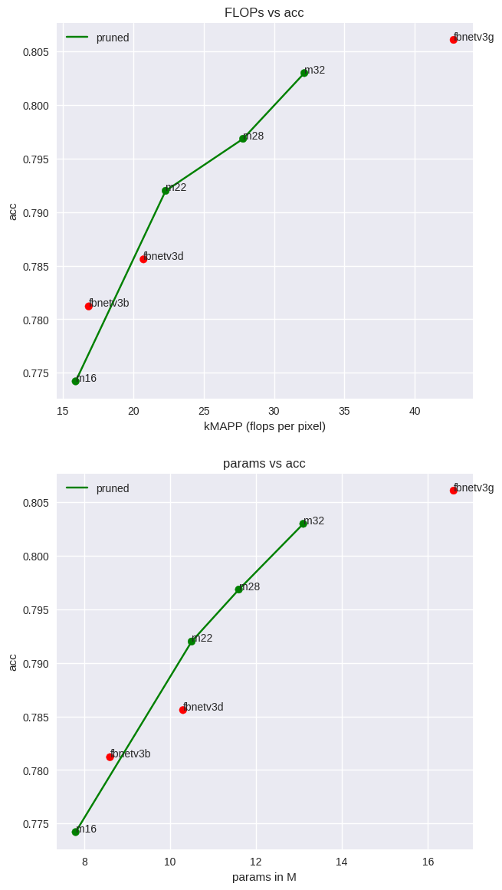
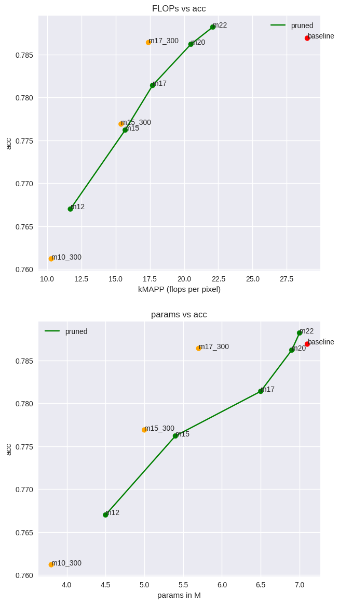
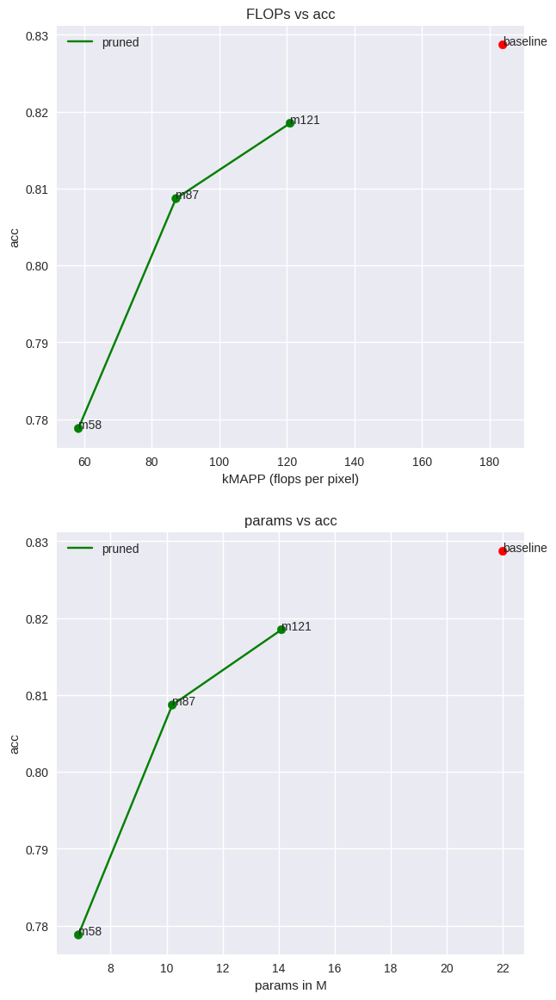
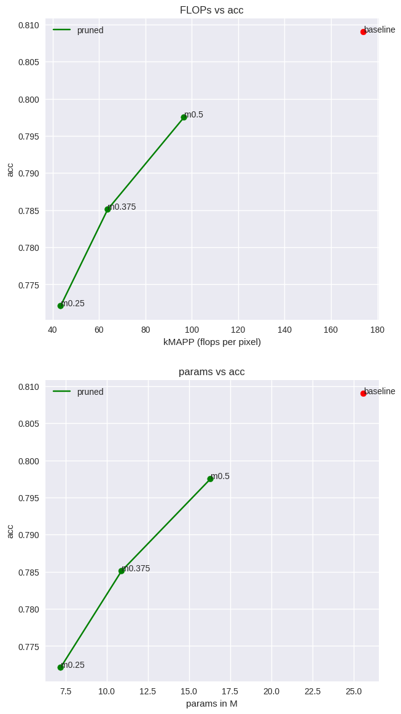
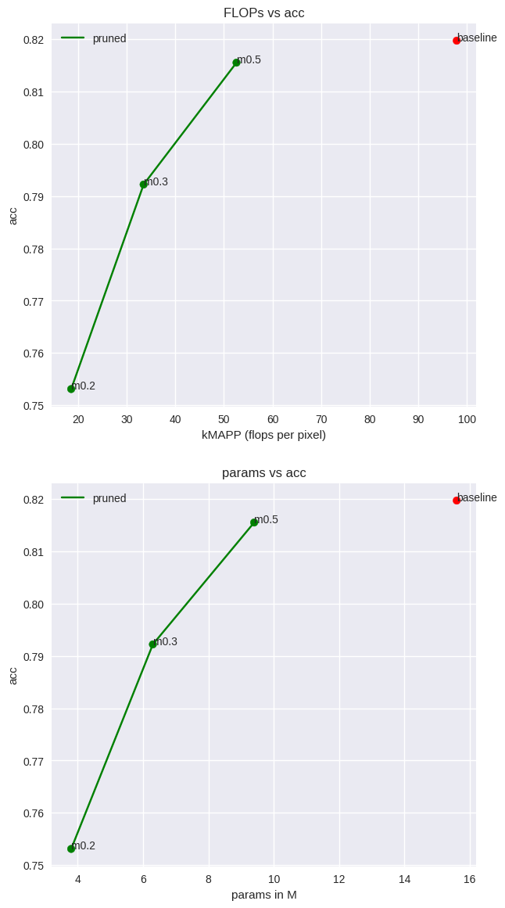

:red_circle: All the model can be found in `/nas/projects/auto-ml/torch_dag/optimized_models`

## Intro

In this readme we use a couple of terms that may not be commonly known. To facilitate easier reading we provide their
definitions here:

**HKD**: HIerarchical Knowledge Distillation - a finetuning process where we switch the teacher modes from smaller to
larger ones as the training progresses.

**kmapp**: FLOPs per pixel of input in thousands

## [fbnetv3_g.ra2_in1k](https://huggingface.co/timm/fbnetv3_g.ra2_in1k)

> `FBNETV3` is a sophisticated family of highly optimized model [paper](https://arxiv.org/abs/2006.02049). The Neural
> Architecture Search (NAS) methods used to create original `FBNETV3` architectures searched for model `width` (number
> of
> channels in particular layers). Therefore it's further compression by channel pruning is a hard task.

### Fine-tuning method

We use `HKD` with `fbnetv3_b`, `fbnetv3_d`, `fbnetv3_g` models as teachers. The training resolution is `(224, 224)`. For
image pre-processing we use [DALI](https://github.com/NVIDIA/DALI).

### Results on `ImageNet1K` validation set.

| model                                                               | acc (224x224) | acc (240x240) | kmapp | params (m) |
|---------------------------------------------------------------------|:-------------:|:-------------:|:-----:|------------|
| fbnetv3g                                                            |    0.8061     |    0.8132     | 42.75 | 16.6       |
| fbnetv3d                                                            |    0.7856     |    0.7927     | 20.73 | 10.3       |
| fbnetv3b                                                            |    0.7812     |    0.7871     | 16.84 | 8.6        |
| [m16](https://huggingface.co/TCLResearchEurope/fbnetv3_g_pruned_37) |    0.7742     |    0.7793     | 15.91 | 7.8        |
| [m22](https://huggingface.co/TCLResearchEurope/fbnetv3_g_pruned_52) |    0.7920     |    0.7955     | 22.3  | 10.5       |
| [m28](https://huggingface.co/TCLResearchEurope/fbnetv3_g_pruned_65) |    0.79686    |    0.8016     | 27.8  | 11.6       |
| [m32](https://huggingface.co/TCLResearchEurope/fbnetv3_g_pruned_75) |     0.803     |    0.8025     | 32.15 | 13.1       |

## `efficientnetv2_b0`

The baseline model is taken from [keras](https://keras.io/api/applications/efficientnet_v2/#efficientnetv2b0-function)

### Fine-tuning method

We use `HKD` with `efficientnetv2_b0`, `efficientnetv2_b1`, `efficientnetv2_b2` models as teachers. The training
resolution is `(224, 224)`. For image pre-processing we use [DALI](https://github.com/NVIDIA/DALI). The fine-tuning took
200 epochs, apart from the models with `300` suffix, which where fine-tuned for 300 epochs, just to show that we can get
even better results with slightly longer fine-tuning.

| model                                                                           | acc (224x224) | kmapp | params (m) |
|---------------------------------------------------------------------------------|:-------------:|:-----:|:----------:|
| baseline                                                                        |    0.7869     | 29.0  |    7.1     |
| [m22](https://huggingface.co/TCLResearchEurope/efficientnetv2_b0_pruned_76)     |    0.7882     | 22.1  |    7.0     |
| [m20](https://huggingface.co/TCLResearchEurope/efficientnetv2_b0_pruned_69)     |    0.7862     | 20.5  |    6.9     |
| [m17](https://huggingface.co/TCLResearchEurope/efficientnetv2_b0_pruned_61)     |    0.7814     | 17.7  |    6.5     |
| [m17_300](https://huggingface.co/TCLResearchEurope/efficientnetv2_b0_pruned_60) |    0.7864     | 17.4  |    5.7     |
| [m15](https://huggingface.co/TCLResearchEurope/efficientnetv2_b0_pruned_54)     |    0.7762     | 15.7  |    5.4     |
| [m15_300](https://huggingface.co/TCLResearchEurope/efficientnetv2_b0_pruned_53) |    0.7769     | 15.4  |    5.0     |
| [m12](https://huggingface.co/TCLResearchEurope/efficientnetv2_b0_pruned_40)     |    0.7670     | 11.7  |    4.5     |
| [m10_300](https://huggingface.co/TCLResearchEurope/efficientnetv2_b0_pruned_35) |    0.7612     | 10.3  |    3.8     |

## [deit3_small_patch16_224.fb_in22k_ft_in1k](https://huggingface.co/timm/deit3_small_patch16_224.fb_in22k_ft_in1k)

A vision transformer model trained on `ImageNet21K` and finet-tuned on `ImageNet1K`.

### Fine-tuning method

We use `HKD` with `deit3_small_patch16_224.fb_in22k_ft_in1k` and `
deit3_base_patch16_224.fb_in22k_ft_in1k` models as teachers. The training resolution is `(224, 224)`. For image
pre-processing we use [DALI](https://github.com/NVIDIA/DALI). The fine-tuning took 200 epochs.

|                                       model                                        | acc (224x224) | kmapp | params (m) |
|:----------------------------------------------------------------------------------:|:-------------:|:-----:|:----------:|
|                                      baseline                                      |    0.8287     | 184.0 |    22.0    |
| [m121](https://huggingface.co/TCLResearchEurope/deit3_small_patch16_224_pruned_66) |    0.8185     | 121.0 |    14.1    |
| [m87](https://huggingface.co/TCLResearchEurope/deit3_small_patch16_224_pruned_47)  |    0.8087     | 87.2  |    10.2    |
| [m58](https://huggingface.co/TCLResearchEurope/deit3_small_patch16_224_pruned_32)  |    0.7788     | 58.3  |    6.85    |

## `resnet50d`

### Fine-tuning method

We use `HKD` with the original model as teacher. The training resolution is `(224, 224)`. For image pre-processing we
use [DALI](https://github.com/NVIDIA/DALI). The fine-tuning took 200 epochs.

|                                 model                                  | acc (224x224) | kmapp | params (m) |
|:----------------------------------------------------------------------:|:-------------:|:-----:|:----------:|
|                                baseline                                |     0.809     | 174.0 |    25.6    |
|  [m0.5](https://huggingface.co/TCLResearchEurope/resnet50d_pruned_56)  |    0.7975     | 96.6  |    16.3    |
| [m0.375](https://huggingface.co/TCLResearchEurope/resnet50d_pruned_37) |    0.7851     | 63.7  |    10.9    |
| [m0.25](https://huggingface.co/TCLResearchEurope/resnet50d_pruned_25)  |    0.7721     | 43.4  |    7.2     |

## [convnextv2_nano.fcmae_ft_in22k_in1k](https://huggingface.co/timm/convnextv2_nano.fcmae_ft_in22k_in1k)

We use `HKD` with `convnextv2_nano.fcmae_ft_in22k_in1k` and `convnextv2_tiny.fcmae_ft_in22k_in1k` as teachers. The
training resolution is `(224, 224)`. For image pre-processing we use [DALI](https://github.com/NVIDIA/DALI). The
fine-tuning took 200 epochs.

|                                    model                                    | acc (224x224) | kmapp | params (m) |
|:---------------------------------------------------------------------------:|:-------------:|:-----:|:----------:|
|                                  baseline                                   |    0.8197     | 97.9  |    15.6    |
| [m0.5](https://huggingface.co/TCLResearchEurope/convnetxtv2_nano_pruned_54) |    0.8155     | 52.6  |    9.4     |
| [m0.3](https://huggingface.co/TCLResearchEurope/convnetxtv2_nano_pruned_34) |    0.7922     | 33.5  |    6.3     |
| [m0.2](https://huggingface.co/TCLResearchEurope/convnetxtv2_nano_pruned_19) |    0.7531     | 18.6  |    3.8     |

## [rexnetr_200.sw_in12k_ft_in1k](https://huggingface.co/timm/rexnetr_200.sw_in12k_ft_in1k)

We use `KD` with the original model as teacher. The
training resolution is `(224, 224)`. For image pre-processing we use [DALI](https://github.com/NVIDIA/DALI). The
fine-tuning took 200 epochs.

|                                  model                                   | acc (224x224) | kmapp | params (m) |
|:------------------------------------------------------------------------:|:-------------:|:-----:|:----------:|
|                                 baseline                                 |     0.826     | 63.4  |    16.5    |
|  [m0.5](https://huggingface.co/TCLResearchEurope/rexnetr_200_pruned_51)   |     0.808     | 32.6  |    8.7     |
| [m0.375](https://huggingface.co/TCLResearchEurope/rexnetr_200_pruned_38) |     0.791     | 24.0  |    6.1     |

## [yolov8s](link)

We use `yolov8` training recipe and fine-tune the pruned models for 200 eposch on `COCO`.
For image pre-processing we use [DALI](https://github.com/NVIDIA/DALI).

|                               model                               | mAP50-95 | kmapp | params (m) |
|:-----------------------------------------------------------------:|:--------:|:-----:|:----------:|
|                             `yolov8n`                             |   37.3   | 21.5  |    3.16    |
| [m15](https://huggingface.co/TCLResearchEurope/yolov8n_pruned_73) |   34.9   | 15.7  |    2.65    |
| [m12](https://huggingface.co/TCLResearchEurope/yolov8n_pruned_59) |   33.3   | 12.6  |    2.0     |
| [m9](https://huggingface.co/TCLResearchEurope/yolov8n_pruned_43)  |   29.9   |  9.2  |    1.2     |

---

## Additional models form `timm`

We use `KD` with the original model as teacher. The
training resolution is `(224, 224)`. For image pre-processing we use [DALI](https://github.com/NVIDIA/DALI). The
fine-tuning took 200 epochs.

| model                                                                                                                           |           acc (224x224)           |         kmapp         |      params (m)      |
|:--------------------------------------------------------------------------------------------------------------------------------|:---------------------------------:|:---------------------:|:--------------------:|
| [poolformerv2_s24.sail_in1k](https://huggingface.co/timm/poolformerv2_s24.sail_in1k) / [pruned](https://huggingface.co/TCLResearchEurope/poolformerv2_s24_pruned_52)                               |      0.8071/0.8040 ↓ 0.0029       | 136.8/71.0 ↓ **49%**  | 21.3/13.5 ↓ **37%**  |
| [beit_base_patch16_224.in22k_ft_in22k_in1k](https://huggingface.co/timm/beit_base_patch16_224.in22k_ft_in22k_in1k) / [pruned](https://huggingface.co/TCLResearchEurope/beit_base_patch16_224_pruned_65) |       0.8523/0.8453 ↓ 0.007       | 673.2/438.1 ↓ **35%** | 86.5/56.7 ↓ **34%**  |
| [efficientformerv2_s2.snap_dist_in1k](https://huggingface.co/timm/efficientformerv2_s2.snap_dist_in1k) / [pruned](https://huggingface.co/TCLResearchEurope/efficientformerv2_s2_pruned_72)             |       0.822/0.8158 ↓ 0.0064       |  50.7/36.7 ↓ **28%**  | 12.7/10.1  ↓ **20%** |
| [convformer_s18.sail_in22k_ft_in1k](https://huggingface.co/timm/convformer_s18.sail_in22k_ft_in1k) / [pruned](https://huggingface.co/TCLResearchEurope/convformer_s18_pruned_43)                 |      0.8376/0.8253 ↓ 0.0123       | 158.5/68.8 ↓ **57%**  | 26.8/15.8  ↓ **41%** |
| [mobilevitv2_200.cvnets_in22k_ft_in1k](https://huggingface.co/timm/mobilevitv2_200.cvnets_in22k_ft_in1k)  / pruned              | 0.8233/0.8253 ↑ 0.00123 (256x256) | 224.3/135.5 ↓ **40%** | 18.4/17.1  ↓ **7%**  |
| [swinv2_cr_tiny_ns_224.sw_in1k](https://huggingface.co/timm/swinv2_cr_tiny_ns_224.sw_in1k)  / [pruned](https://huggingface.co/TCLResearchEurope/swinv2_cr_tiny_ns_224_pruned_59)                        |      0.8153/0.8107  ↓ 0.0046      | 185.8/109.4 ↓ **41%** | 28.3/18.2  ↓ **36%** |

